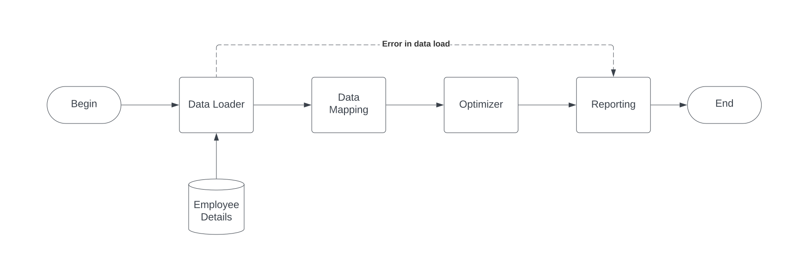
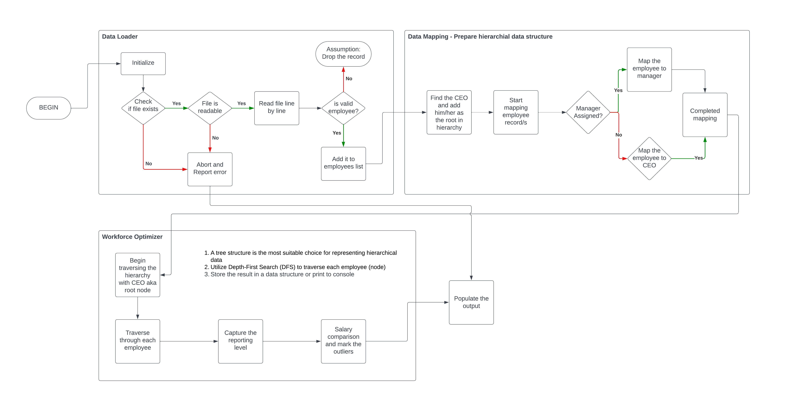

# workforce-optimizer

## Problem Statement

An X company would like to analyze its organizational structure and identify potential improvements. Board wants to make sure that every manager earns at least 20% more than the average salary of its direct subordinates, but no more than 50% more than that average. Company wants to avoid too long reporting lines, therefore we would like to identify all employees which have more than 4 managers between them and the CEO.

## Requirements

### Functional Requirements

Acceptance criteria:
- which managers earn less than they should, and by how much
- which managers earn more than they should, and by how much
- which employees have a reporting line which is too long, and by how much

### Non-Functional Requirements

- Configurability - Dynamic parameter changes should not require code updates
- Modularity - Ensure that modifications to one component have minimal impact on others
- Reusability - Products or modules should remain reusable when incorporating new requirements
- Safety - Handle exceptions gracefully to ensure a smooth and controlled exit
- Modifiability - System can be effectively and efficiently modified without introducing defects or degrading existing product quality
- Testability - Ensure the application successfully fulfills all test criteria
- Analysability - The ability to easily evaluate how a change affects a product, detect issues or failures, and identify parts that need modification

## Solution Discovery

### Design

#### Target Business Architecture


#### Target Technical Architecture


#### Assumptions

 - If CEO is not available in the data then abort the execution
 - CEO has an employee id of `-1`
 - A valid employee must have at least an employee ID and a salary
    - An invalid employee record will be dropped from processing (Eg: employee doesn't have an id/salary)
    - If a new employee hasn't been assigned a manager yet, they will automatically report to the CEO by default
 - Reporting module will involve displaying the output on the console

### Technology & Tools

 - Java - 21.0.4
 - Maven - 3.9.9
 - JUnit - 5.10.2
 - Mockito - 5.15.2
 - Development Environment - IntelliJ IDEA Community edition
 - Architecture design - Lucid chart
 
### Environment Setup

Create a base project
```
mvn -B archetype:generate -DgroupId=com.xorg.wo -DartifactId=workforce-optimizer -Dversion=1.0.0 -DarchetypeGroupId=com.dominikcebula.archetypes -DarchetypeArtifactId=java21-basic-archetype -DarchetypeVersion=1.0
```

Compile
```
mvn clean compile
```

Execute the project
```
mvn clean compile exec:java -Dexec.mainClass="com.xorg.wo.Application"
```

Unit test
```
mvn test
```